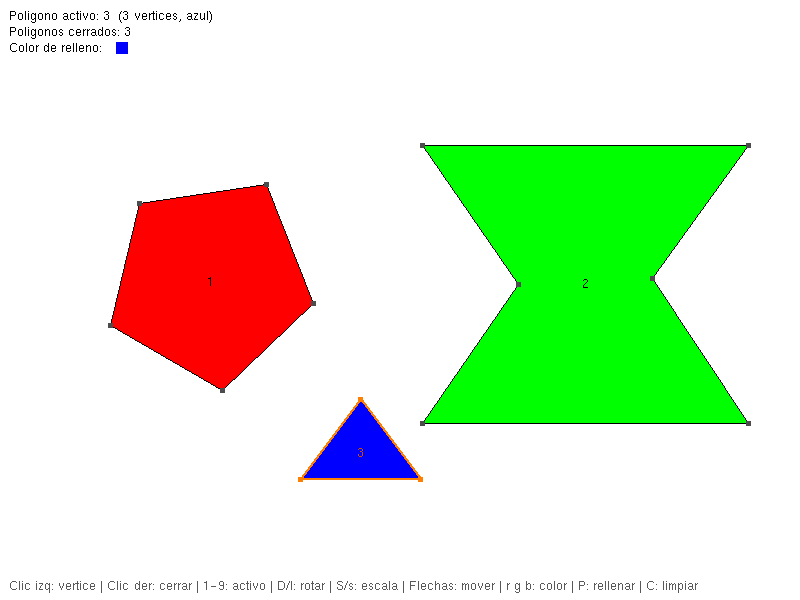
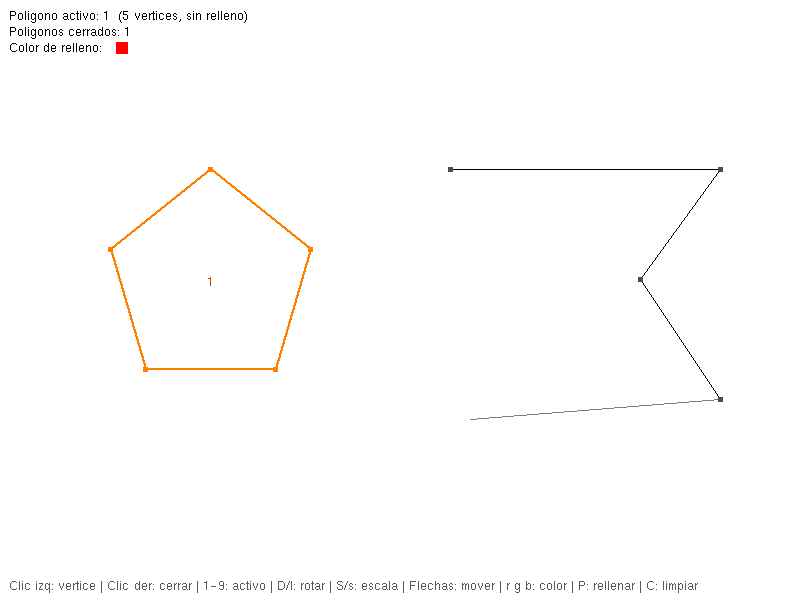
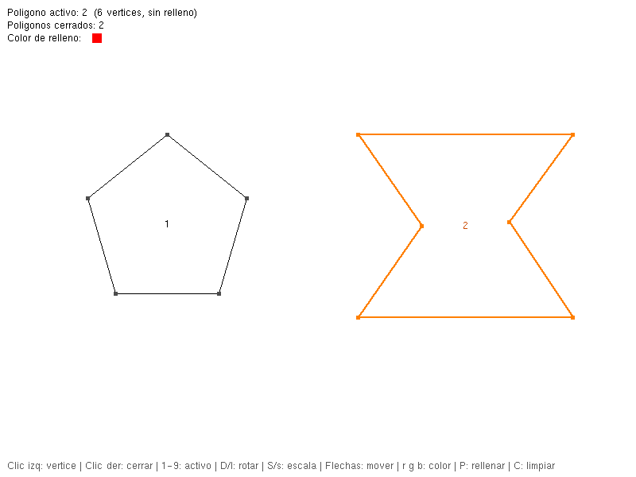
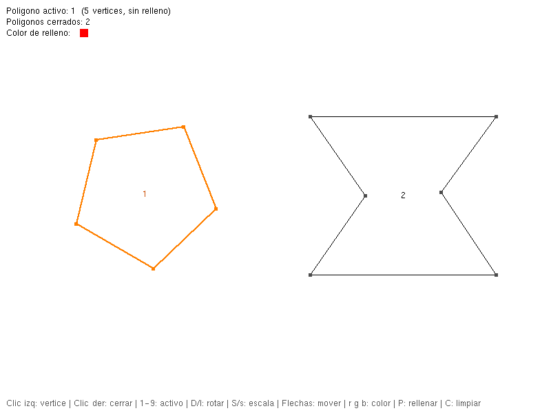
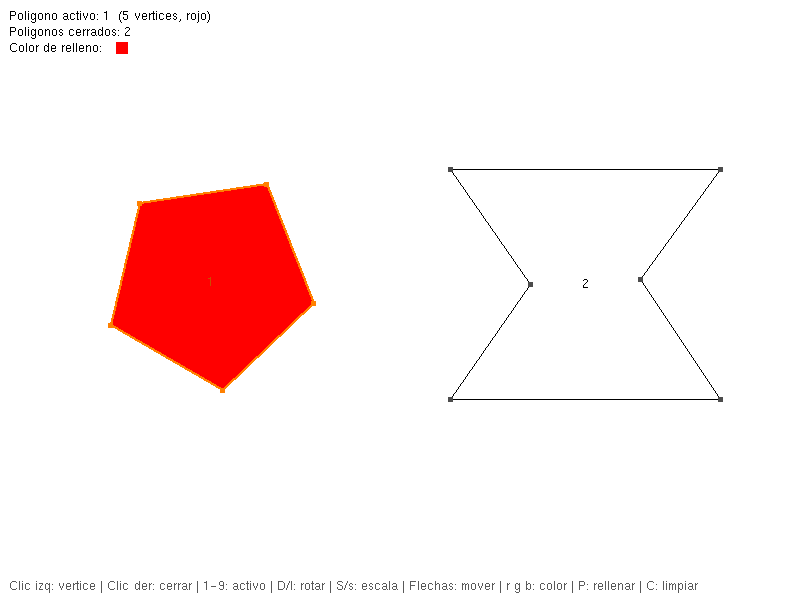
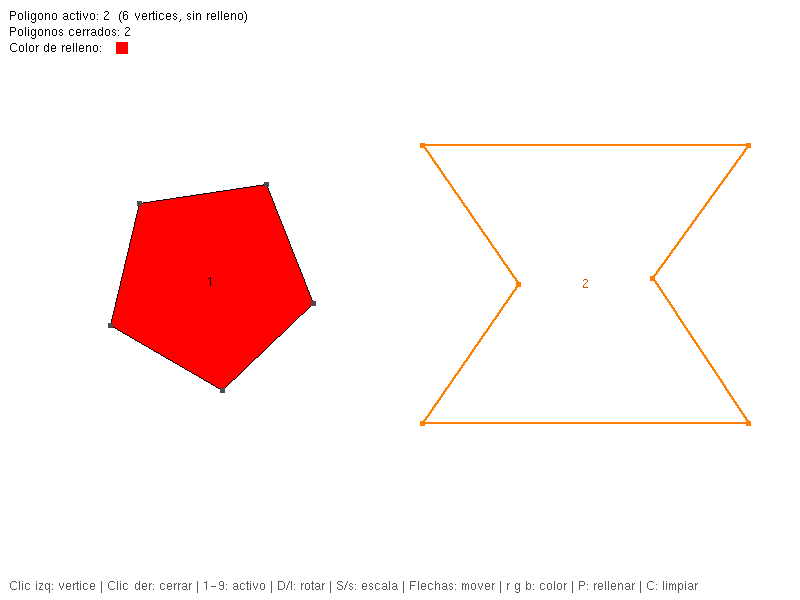
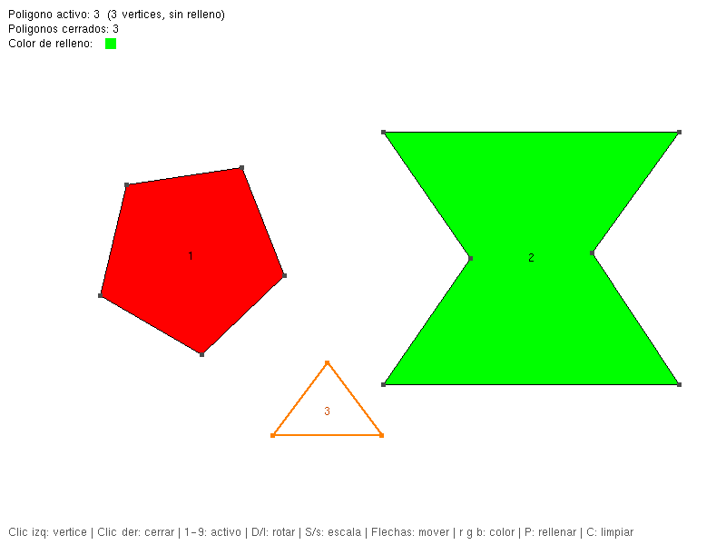
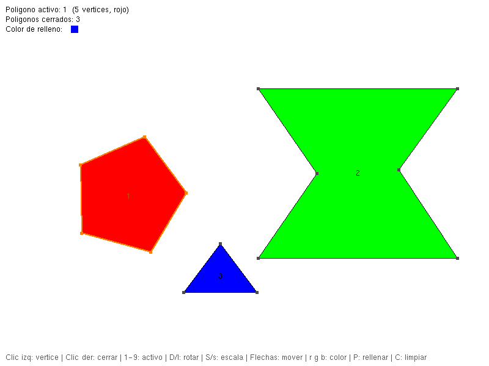

# Actividad 6: Integración final

Aplicación en C++ con OpenGL (GLUT) que reúne en un solo programa lo desarrollado en las actividades anteriores. Permite crear varios polígonos con el mouse y rasterizar su contorno con **Bresenham**. También permite rotarlos, escalarlos y trasladarlos con **matrices homogéneas**, y rellenarlos con el algoritmo **Scan-Line usando ET y EAT**.

- **Curso:** Computación Gráfica, Semana 4
- **Autor:** Guillermo Cano Luque
- **Entorno:** Windows + [ZinjaI](http://zinjai.sourceforge.net/) (MinGW GCC 6.3 + freeglut)



## Contenido

1. [Código reutilizado](#1-código-reutilizado)
2. [Compilación en ZinjaI](#2-compilación-en-zinjai)
3. [Controles](#3-controles)
4. [Estructura de cada polígono y su color](#4-estructura-de-cada-polígono-y-su-color)
5. [Pruebas realizadas](#5-pruebas-realizadas)
6. [Archivos del repositorio](#6-archivos-del-repositorio)

## 1. Código reutilizado

| Actividad anterior | Qué se reutilizó |
|---|---|
| `LineasMouse.cpp` / `Poligono.cpp` | Algoritmo de **Bresenham**, captura de vértices con el mouse y línea guía hasta el cursor |
| `variospoligonos.cpp` | Lista de **varios polígonos**, cierre con clic derecho y selección del polígono activo |
| `transformaciones.cpp` | **Matrices homogéneas 3×3**: identidad, multiplicación, traslación, rotación y escala respecto al centro |
| `Relleno.cpp` | Relleno **Scan-Line con ET y EAT** y selección de color con `r`, `g`, `b` |

## 2. Compilación en ZinjaI

**Opción A (recomendada).** Abrir el proyecto [`IntegracionFinal.zpr`](IntegracionFinal.zpr) desde *Archivo → Abrir* y presionar **F9**. El proyecto ya trae configurado:

- Directorios: `${MINGW_DIR}\OpenGl\include` y `${MINGW_DIR}\OpenGl\lib`
- Macro: `FREEGLUT_STATIC`
- Bibliotecas: `freeglut_static, glu32, opengl32, winmm, gdi32`

**Opción B.** Abrir [`IntegracionFinal.cpp`](IntegracionFinal.cpp) como programa simple. Luego, en *Ejecución → Opciones…*, agregar en *Parámetros extra para el compilador*:

```text
-DFREEGLUT_STATIC -lfreeglut_static -lglu32 -lopengl32 -lwinmm -lgdi32 -L${MINGW_DIR}\OpenGl\lib -I${MINGW_DIR}\OpenGl\include
```

Son las mismas opciones de la plantilla *"OpenGL - Windows"* de ZinjaI.

> **Nota:** el ejecutable y los archivos intermedios (`debug.w32/`, `release.w32/`, `*.o`, `*.exe`) no se suben al repositorio (ver [`.gitignore`](.gitignore)). Se generan al compilar.

## 3. Controles

| Control | Acción |
|---|---|
| Clic izquierdo | Agregar vértice |
| Clic derecho | Cerrar polígono (mínimo 3 vértices) |
| `1` … `9` | Seleccionar polígono activo |
| `D` / `I` | Rotar 5° a la derecha / izquierda |
| `S` / `s` | Aumentar / disminuir la escala un 10 % |
| Flechas | Trasladar el polígono activo 10 píxeles |
| `r`, `g`, `b` | Seleccionar color de relleno (rojo, verde, azul) |
| `P` | Rellenar el polígono activo con el color seleccionado |
| `C` | Limpiar todo |
| `ESC` | Salir |

El polígono activo se dibuja en **naranja** y los demás en negro. Arriba a la izquierda se muestran el polígono activo, su color y el color de relleno seleccionado. La consola muestra cada vértice agregado y la **matriz homogénea compuesta** de cada transformación.

## 4. Estructura de cada polígono y su color

```cpp
struct Punto
{
    float x;
    float y;
};

struct Color
{
    float r, g, b;
};

struct Poligono
{
    vector<Punto> P;   // vértices en orden
    bool cerrado;      // true cuando se cerró con clic derecho
    bool relleno;      // true cuando se rellenó con la tecla P
    Color color;       // color de relleno propio de este polígono
};

vector<Poligono> poligonos;  // todos los polígonos de la escena
int poligonoActual;          // polígono que se está construyendo con el mouse
int poligonoActivo;          // polígono seleccionado (1..9)
Color colorSeleccionado;     // color elegido con r, g, b
```

- **Vértices en `float`.** Las rotaciones y escalas se aplican una sobre otra. Si los vértices se guardaran como enteros, el error de redondeo se acumularía y el polígono se deformaría. Por eso se guardan en `float` y solo se redondean a enteros al rasterizar (Bresenham y ET).
- **Color guardado en cada polígono.** Las teclas `r`, `g`, `b` solo cambian `colorSeleccionado`. Al presionar `P`, ese color se **copia** dentro del polígono activo (`pol.color = colorSeleccionado`) y se marca `pol.relleno = true`. Así cada polígono conserva su propio color aunque después se elija otro o se cambie de polígono activo.
- **Relleno recalculado en cada cuadro.** En cada redibujado se reconstruye la ET a partir de los vértices actuales. Por eso el relleno sigue correctamente al polígono después de rotarlo, escalarlo o trasladarlo.
- **Transformaciones con matrices homogéneas.** Todas usan matrices 3×3:
  - Rotación: `M = T(C) · R(θ) · T(−C)`
  - Escala: `M = T(C) · S(s) · T(−C)`
  - Traslación: `M = T(tx, ty)`

  `C` es el centro del polígono, así el polígono gira y se escala sobre sí mismo. Cada vértice se transforma como `P' = M · [x y 1]ᵀ`.
- **Relleno Scan-Line.** Se construye la ET con un "cesto" por cada `y`, indexada con `y − yMin` para que funcione aunque el polígono salga de la ventana. Las aristas horizontales no ingresan. En cada línea de barrido:
  1. Se pasan a la EAT las aristas con `ymin = y`.
  2. Se retiran las que tienen `ymax = y`.
  3. Se ordena por `x`.
  4. Se pintan los píxeles entre pares de intersecciones, uno por uno con `GL_POINTS`.
  5. Se actualiza `x += 1/m`.

  **No se usa `GL_POLYGON`** ni ninguna otra primitiva de relleno.

## 5. Pruebas realizadas

| # | Prueba requerida | Evidencia |
|---|---|---|
| 1 | Polígono convexo | [04_rotacion_relleno_convexo.png](capturas/04_rotacion_relleno_convexo.png) |
| 2 | Polígono cóncavo | [06_escalamiento_relleno_concavo.png](capturas/06_escalamiento_relleno_concavo.png) |
| 3 | Al menos dos polígonos simultáneamente | [02_dos_poligonos_bresenham.png](capturas/02_dos_poligonos_bresenham.png) |
| 4 | Dos polígonos con colores de relleno diferentes | [08_traslacion_relleno.png](capturas/08_traslacion_relleno.png) |
| 5 | Rotación seguida de relleno | [03_rotacion.png](capturas/03_rotacion.png) → [04_rotacion_relleno_convexo.png](capturas/04_rotacion_relleno_convexo.png) |
| 6 | Escalamiento seguido de relleno | [05_escalamiento.png](capturas/05_escalamiento.png) → [06_escalamiento_relleno_concavo.png](capturas/06_escalamiento_relleno_concavo.png) |
| 7 | Traslación seguida de relleno | [07_traslacion.png](capturas/07_traslacion.png) → [08_traslacion_relleno.png](capturas/08_traslacion_relleno.png) |

La salida de la consola de esta ejecución (vértices y matrices de cada transformación) está en [`capturas/salida_consola.txt`](capturas/salida_consola.txt).

### Creación de polígonos con el mouse

El polígono 1 ya está cerrado y el polígono 2 está en construcción, con la línea guía (gris) hasta el cursor.



### Dos polígonos simultáneos

Ambos polígonos están cerrados y su contorno está rasterizado con Bresenham. El activo (2) se ve en naranja.



### Rotación seguida de relleno (polígono convexo)

Se presiona `1`, luego `D` seis veces (−30°):



Luego se presiona `r` y `P`:



### Escalamiento seguido de relleno (polígono cóncavo)

Se presiona `2`, luego `S` dos veces (×1.21):



Luego se presiona `g` y `P`:


### Traslación seguida de relleno

Se crea el polígono 3:


Se traslada con las flechas (↑ ×5, ← ×3):



Luego se presiona `b` y `P`. Quedan tres polígonos con tres colores distintos:


### El color se conserva

Se vuelve a seleccionar el polígono 1 y se rota, traslada y reduce. Sigue rojo aunque el color seleccionado ahora es azul, y los polígonos 2 y 3 mantienen su color.



## 6. Archivos del repositorio

| Archivo | Descripción |
|---|---|
| [`IntegracionFinal.cpp`](IntegracionFinal.cpp) | Código fuente de la aplicación integrada |
| [`IntegracionFinal.zpr`](IntegracionFinal.zpr) | Proyecto de ZinjaI ya configurado para OpenGL |
| [`capturas/`](capturas) | Capturas de las pruebas y salida de la consola |
| [`.gitignore`](.gitignore) | Excluye los archivos generados al compilar |

## Preguntas de Rasterización de polígonos y transformaciones geométricas.

### 1. ¿Qué diferencia existe entre rasterizar la frontera de un polígono y rellenar su interior?

Rasterizar la frontera consiste en identificar y dibujar los píxeles que forman los bordes o aristas del polígono. En cambio, rellenar su interior consiste en identificar los píxeles que se encuentran dentro de sus límites para pintarlos. La frontera representa el contorno de la figura, mientras que el relleno permite visualizar toda su superficie.

### 2. ¿Por qué las aristas horizontales no se incorporan a la ET en el algoritmo trabajado?

Las aristas horizontales no se incorporan a la Tabla de Aristas (ET) porque su variación en el eje Y es cero (\(\Delta y = 0\)). Como el algoritmo utiliza la pendiente inversa \(\Delta x / \Delta y\) para actualizar la posición de las intersecciones, incluirlas provocaría una división entre cero. Además, estas aristas no atraviesan diferentes líneas de barrido, por lo que no son necesarias para calcular el relleno interior.

### 3. ¿Por qué una arista deja de estar activa al alcanzar su ymax?

Una arista deja de estar activa cuando la línea de barrido alcanza su coordenada máxima en Y (\(ymax\)) porque, a partir de ese punto, ya no debe generar intersecciones con las siguientes líneas de barrido. Retirarla de la Tabla de Aristas Activas (EAT) evita contar intersecciones que ya no corresponden a esa arista y ayuda a prevenir errores en el relleno del polígono.

### 4. ¿Qué representa Δx/Δy durante la actualización de la EAT?

El valor \(\Delta x / \Delta y\) representa la pendiente inversa de una arista, es decir, cuánto cambia la coordenada X por cada unidad que avanza la coordenada Y. En cada nueva línea de barrido, este valor se suma a la coordenada X de la intersección anterior para calcular la nueva posición de la arista, sin necesidad de recalcular toda la ecuación de la recta.

### 5. ¿Por qué ET y EAT deben calcularse a partir de las coordenadas actuales después de transformar un polígono?

Porque las transformaciones geométricas, como la traslación, la rotación y el escalamiento, modifican las coordenadas y pueden cambiar las pendientes, las intersecciones y los límites verticales de las aristas. Por ello, la Tabla de Aristas (ET) y la Tabla de Aristas Activas (EAT) deben construirse utilizando las coordenadas actualizadas del polígono para que el relleno coincida con su nueva posición, orientación y tamaño.

### 6. ¿Qué ventaja ofrecen las coordenadas homogéneas para integrar traslación, rotación y escalamiento?

Las coordenadas homogéneas permiten representar la traslación, la rotación y el escalamiento mediante matrices de transformación. Su principal ventaja es que estas operaciones pueden combinarse multiplicando sus matrices y aplicarse al punto mediante una sola matriz compuesta. Esto simplifica el código, facilita la aplicación de varias transformaciones consecutivas y permite mantener un procedimiento uniforme para transformar los vértices del polígono.
